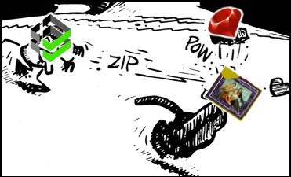

# Recreate the Ruby puppet server

#### Table of Contents
<!-- vim-markdown-toc GFM -->

* [Description](#description)
* [Setup](#setup)
  * [Requirements](#requirements)
  * [Beginning with simp-webrick](#beginning-with-simp-webrick)
    * [Running from Ruby](#running-from-ruby)
    * [Running in podman](#running-in-podman)
      * [Standalone Compiler](#standalone-compiler)
      * [Behind Passenger](#behind-passenger)
    * [Running in minikube](#running-in-minikube)
      * [Running a Cluster](#running-a-cluster)
* [TODO](#todo)

<!-- vim-markdown-toc -->

## Description

* Want an easy-to-scale Puppet Server that's quick to start and a LOT lighter
  than [Trapperkeeper]?
* Missing the days of running `puppet master --no-daemonize --debug --verbose`
  to debug your janky server-side compiles?
* Good news: **This project is for you!**

Forked from https://github.com/puppetlabs/puppet, commit [`fd4024d`]—the final
commit before the tragic merge of [puppet#6794].

:fire::warning::fire:
WARNING: **MASSIVE WORK IN PROGRESS** _(…but it seems to work :-D)_
:fire::warning::fire:

## Setup

### Requirements

For executing directly with Ruby:

* [Ruby]
* [Bundler]

### Beginning with simp-webrick

#### Running from Ruby

```sh
bundle update
bundle exec ruby puppet_server --no-daemonize --debug -v
```

#### Running in podman

##### Standalone Compiler

* podman build --tag "puppet_webrick" --file Dockerfile
* podman run --hostname puppet -p 8140:8140 -d puppet_webrick

##### Behind Passenger

* podman build --tag "puppet_passenger" --file Dockerfile.passenger
* podman run --hostname puppet -p 8140:8140 -d puppet_passenger

#### Running in minikube

* Install `minikube`
* `minikube start`
* Run a local registry
  * `kubectl create -f k8s/local_registry.yml`
  * `kubectl port-forward --namespace kube-system $(kubectl get pod -n kube-system | grep kube-registry-v0 | \awk '{print $1;}') 5000:5000`
* Create the container image
  * `buildah bud -t puppetmaster:latest -f Dockerfile`
* Update your `podman` configuration
  * Add `localhost` to the `registries` array of `[registries.insecure]` in `/etc/containers/registries.conf`
* Push the container image
  * `podman push localhost/puppetmaster localhost:5000/puppetmaster`
* Run the pod
  * `kubectl create -f k8s/puppetmaster.yml`

##### Running a Cluster

* Enable the puppetmaster cluster
  * `kubectl apply -f k8s/puppetmaster_deployment.yml`
* Expose the port
  * `minikube addons enable ingress`

## TODO

* [ ] Attach some clients
* [x] Autoscale puppetmaster compilers as a cluster
* [ ] Compare and contrast to the "real thing"
* [ ] Create a shared volume for the CA materials
* [ ] Create a shared volume for the environment code

[ruby]: https://www.ruby-lang.org
[bundler]: https://bundler.io
[`fd4024d`]: https://github.com/puppetlabs/puppet/tree/fd4024d
[`9275e62`]: https://github.com/puppetlabs/puppet/commit/9275e62
[trapperkeeper]: https://github.com/puppetlabs/trapperkeeper
[puppet#6794]: https://github.com/puppetlabs/puppet/pull/6794
